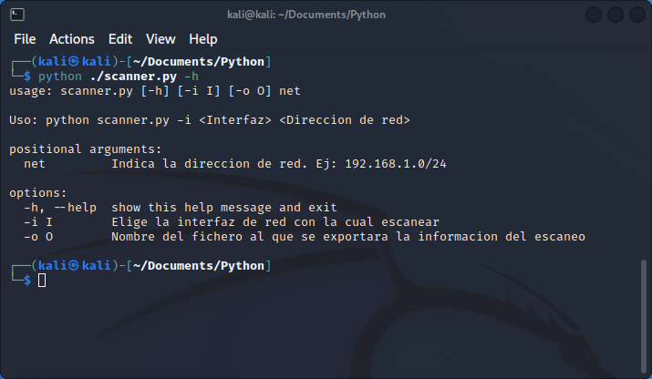
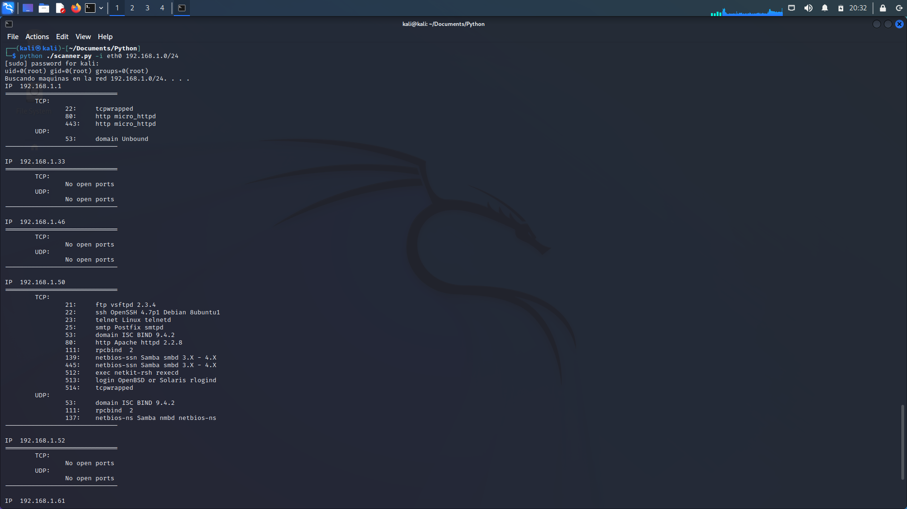
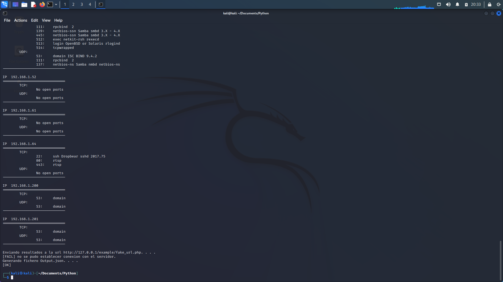
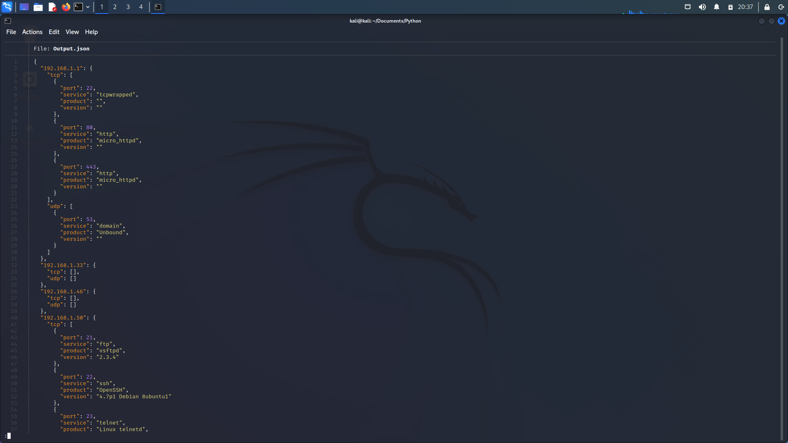
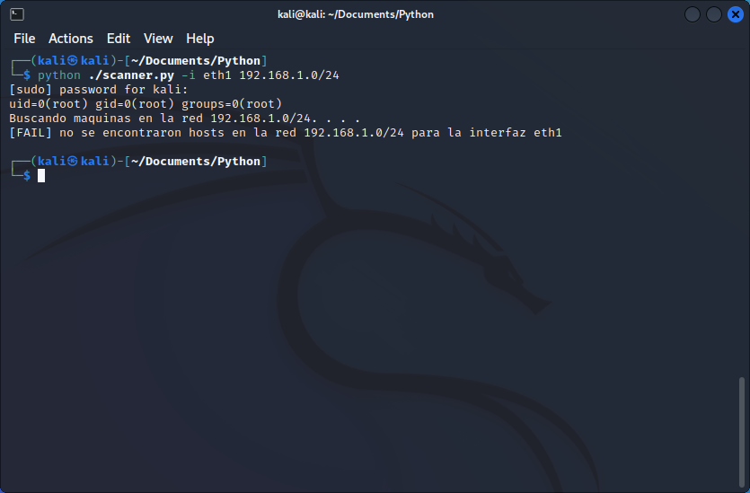
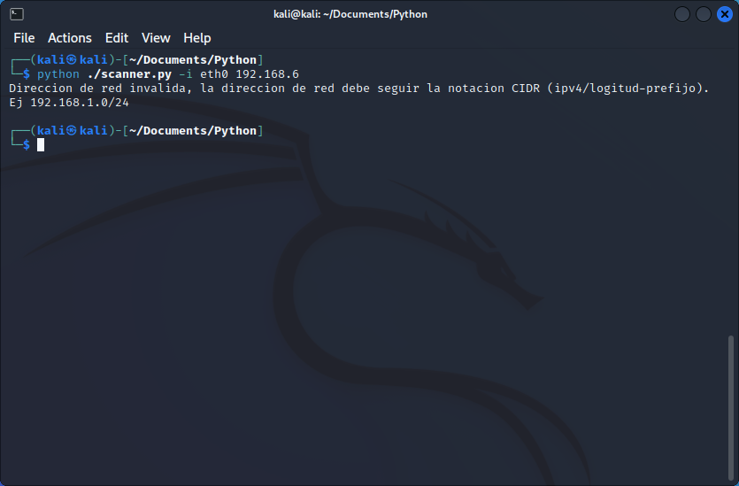

# Uso de la herramienta:

La herramienta cuenta con un menu de ayuda donde se explica como utilizarla.

# Funcionamiento:

Se debe indicar con el parámetro -i la interfaz de usuario en la cual escanear y la dirección de red. Adicional a esto se puede ingresar el parámetro -o con el nombre del fichero de output deseado.
Al realizar esto se solicitara permisos de root y comenzara el escaneo. El script hará un escaneo de todas las Ips existentes en la red, a continuación ira escaneando los puertos TCP y UDP de cada IP encontrada y los ira reportando por consola.
Una vez el escaneo termine enviara toda esta información codificada en formato JSON a la url “http://127.0.0.1/example/fake_url.php” y exportara este mismo archivo JSON con el nombre “Output.json” o bien con el nombre especificado con el parámetro -o.

# Output.json

La información se exportara a un archivo Output.json o bien el nombre indicado por parámetros. El resultado de esta información se ve de la siguiente forma.

# Manejo de errores:

En caso de que no se encuentren hosts en la red se considera que hubo un error en la especificación de la red o la interfaz de red, por lo que sale el siguiente mensaje:

Por otro lado, si se ingresa una dirección de red con un formato invalido sale el siguiente mensaje:

